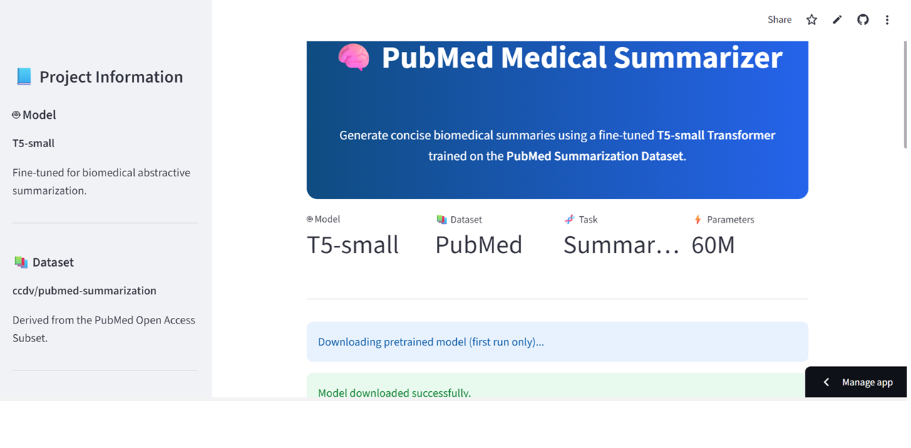
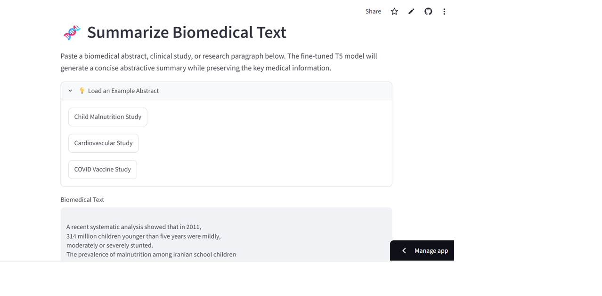
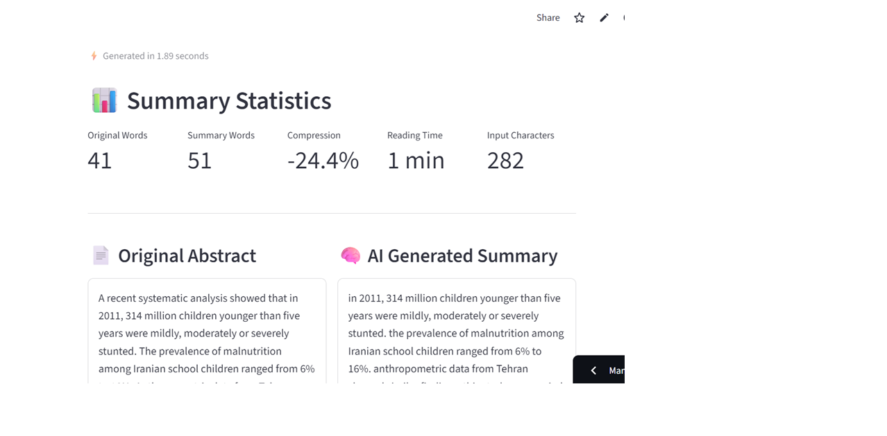

# 🧠 PubMed Medical Summarizer

A Transformer-based Natural Language Processing (NLP) project that fine-tunes the **T5-small** model on the **PubMed Summarization Dataset** to generate concise biomedical research summaries. The project also includes an interactive Streamlit web application for real-time abstractive summarization.

Live Demo: **[Open the PubMed Summarizer](https://sha-md-t5-pubmed-summarizer-app-psrgrl.streamlit.app/)**

---

# 📑 Table of Contents

- [Project Overview](#-project-overview)
- [Business Objective](#-business-objective)
- [Why This Project Matters](#-why-this-project-matters)
- [Features](#-features)
- [Model Development](#-model-development)
- [Dataset](#-dataset)
- [Training Pipeline](#-training-pipeline)
- [Training Results](#-training-results)
- [Streamlit Application](#-streamlit-application)
- [Technologies Used](#-technologies-used)
- [Application Preview](#-application-preview)
- [Future Improvements](#-future-improvements)
- [Author](#-author)

---

# 📌 Project Overview

Biomedical literature is growing at an unprecedented rate, making it increasingly difficult for researchers and healthcare professionals to review large volumes of scientific publications efficiently.

This project demonstrates the application of Transformer-based Natural Language Processing for biomedical text summarization. A **T5-small** model was fine-tuned using the **PubMed Summarization Dataset** to generate concise, readable summaries while preserving key medical information.

The repository contains both:

- Model development and fine-tuning in Jupyter Notebook
- Interactive Streamlit web application for real-time summarization

The application enables users to generate AI-powered summaries of biomedical abstracts in just a few seconds.

---

# 🎯 Business Objective

The objective of this project is to automate biomedical literature summarization, enabling researchers and healthcare professionals to understand scientific publications more efficiently.

Potential users include:

- Medical researchers
- Healthcare professionals
- Biomedical students
- Clinical researchers
- Literature review teams
- Healthcare AI developers

---

# 💡 Why This Project Matters

Thousands of biomedical research papers are published every week. Reviewing them manually is time-consuming and often impractical.

Automated summarization helps users:

- Reduce literature review time
- Improve research productivity
- Quickly identify key findings
- Support evidence-based decision making
- Improve accessibility of scientific publications

Transformer-based language models provide an effective solution for converting lengthy biomedical abstracts into concise, informative summaries.

---

# 🚀 Features

- Fine-tuned T5-small Transformer model
- Biomedical abstractive text summarization
- Interactive Streamlit web application
- Adjustable summary length
- Adjustable beam search quality
- Built-in example biomedical abstracts
- Summary statistics
- Inference time measurement
- Download generated summaries
- Cached model loading for faster inference
- Clean and responsive user interface

---

# 🤖 Model Development

The project uses the **T5-small** sequence-to-sequence Transformer architecture from Hugging Face.

The complete machine learning workflow includes:

- Data cleaning
- Data preprocessing
- Tokenization
- Dataset preparation
- Model fine-tuning
- Text generation
- Model serialization
- Streamlit deployment

---

# 📚 Dataset

**Dataset:** [ccdv/pubmed-summarization](https://huggingface.co/datasets/ccdv/pubmed-summarization)  

**Source:** Hugging Face Datasets

The dataset is derived from the **PubMed Open Access Subset** and contains biomedical research articles paired with expert-written summaries.

For CPU-based fine-tuning, a subset of **1,000 biomedical abstracts** was used.

Each sample contains:

- **article** — Original biomedical abstract
- **abstract** — Human-written reference summary

---

# 🏋️ Training Pipeline

## Data Preprocessing

- Removed missing values
- Removed empty articles
- Removed empty summaries
- Converted data into Hugging Face Dataset format
- Tokenized inputs using the T5 tokenizer
- Applied sequence truncation

## Model Configuration

| Parameter | Value |
|-----------|------:|
| Model | T5-small |
| Epochs | 1 |
| Learning Rate | 3e-5 |
| Batch Size | 2 |
| Weight Decay | 0.01 |
| Training Samples | 1,000 |

---

# 📈 Training Results

The model demonstrated stable convergence during fine-tuning.

| Training Step | Loss |
|--------------:|----:|
|100|3.38|
|200|3.07|
|300|2.99|
|400|2.88|
|500|2.94|

**Final Training Loss:** **3.05**

The fine-tuned model successfully learned to generate concise biomedical summaries while maintaining the essential context of the original abstracts.

---

# 🌐 Streamlit Application

The deployed application allows users to summarize biomedical research abstracts interactively.

### Application Features

- Paste biomedical research abstracts
- Example biomedical abstracts
- Adjustable summary length
- Adjustable beam search quality
- Real-time AI summarization
- Summary statistics
- Inference time measurement
- Download generated summaries
- Model information panel
- Model limitations section

---

# 🛠 Technologies Used

- Python
- Streamlit
- Hugging Face Transformers
- PyTorch
- Hugging Face Datasets
- Pandas
- Requests

---

# 📷 Application Preview

## Home Page

---

## Generated Summary

---

## Summary Statistics

---

# 🚀 Future Improvements

- Evaluate model performance using ROUGE metrics
- Fine-tune using the complete PubMed dataset
- Compare T5-small with BART and PEGASUS
- Support PDF research paper upload
- Biomedical keyword highlighting
- GPU-accelerated inference
- Batch document summarization
- Citation-aware summarization

---

# 👤 Author

**Shabnam Begam Mahammad**  
[LinkedIn](https://www.linkedin.com/in/shabnam-b-mahammad) | [Email](mailto:md.shabnam21@gmail.com) 
---

*"Applying Transformer-based NLP to make biomedical literature more accessible through automated summarization."*
---

